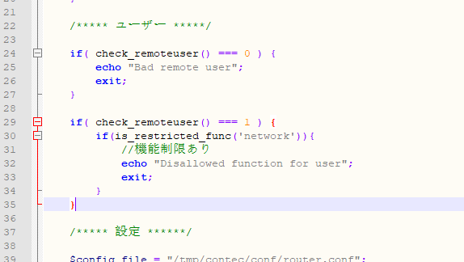
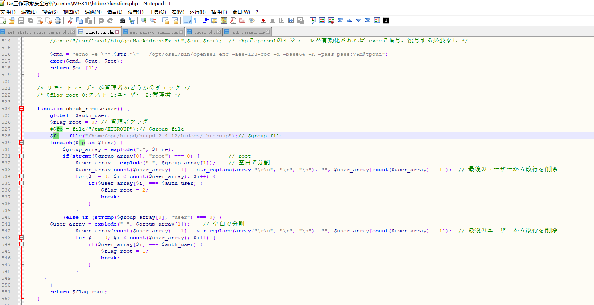
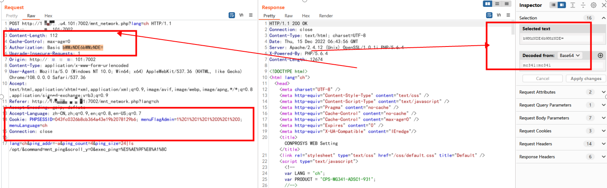
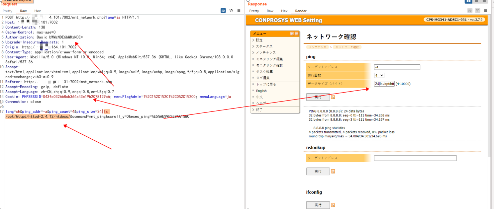
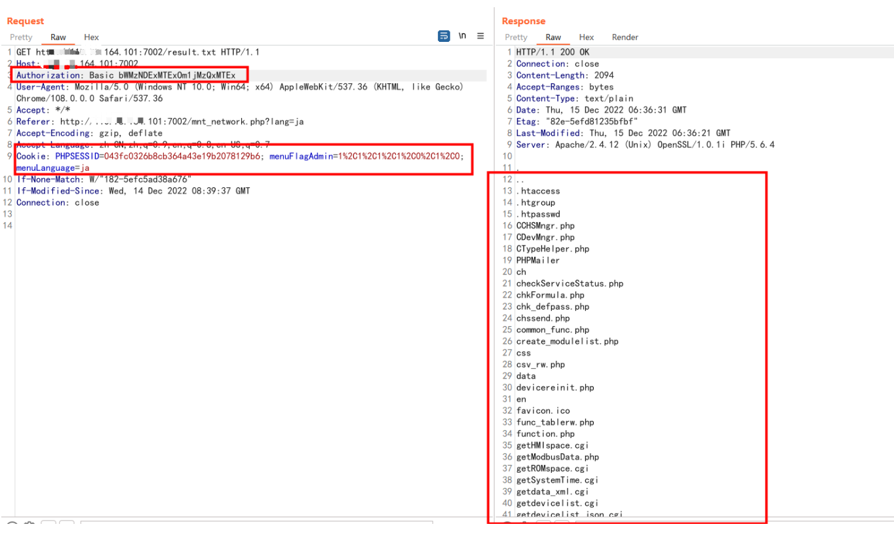
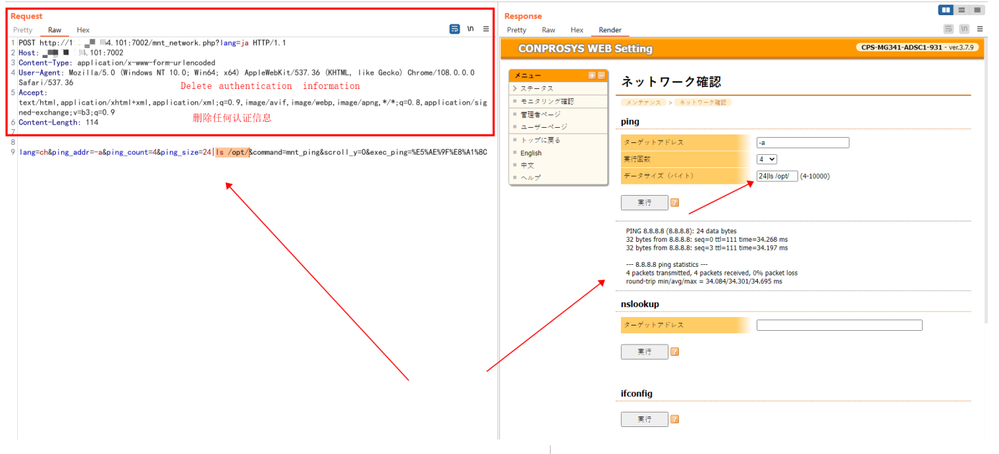
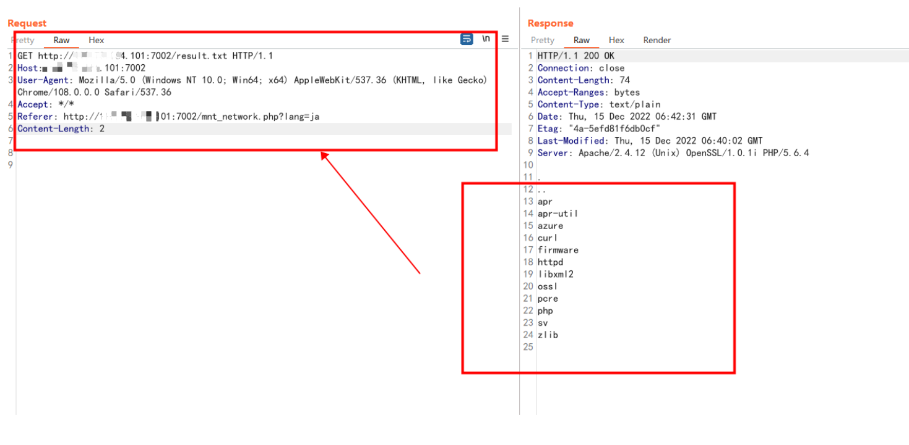

# https://jvn.jp/en/vu/JVNVU96198617/

## **Vulnerability Analysis by JPCERT/CC**
Credit peishilong reported CVE-2023-27917 and CVE-2023-27389 to JPCERT/CC.
Contec CO.,LTD. examined peishilong's report and found CVE-2023-23575.

## Vulnerability description 

Vulnerability name：                  Contec Japan Co., Ltd. Arbitrary Command Execution Vulnerability in  MG341 Network Management Series

Affected Entity Vendor Name：        Contec Japan Co., Ltd.

Affected Entity Name ：   [CPS-MG341-ADSC1-931](https://www.contec.com/cn/products-services/daq-control/iiot-conprosys/m2m-gateway/cps-mg341-adsc1-931/price/)

Product introduction link：  https://www.contec.com/cn/products-services/daq-control/iiot-conprosys/gateway/

## product introduction：

Contec M2M MG341 is a M2M IoT network management product of Japan Contec Co., Ltd. (Contec). Data of equipment controlled by PLC can be easily acquired. Supports various series of MELSEC including Mitsubishi Electric Corporation, Sysmac series of Omron Corporation, JTEKT
Various series of TOYOPUC, FP series of Panasonic Corporation,
And the PLC products of many PLC manufacturers including Keyence's KV series. One device can collect data from multiple PLCs. Reading memory data (I/O status, data registers, link registers, file registers, etc.) that stores setting data and control results can send the collected information to the cloud server through simple settings. Support PLC products from multiple manufacturers. Information can be collected from multiple PLCs simultaneously. PLCs from different vendors and different interfaces can be mixed together and connected to the same M2M gateway.

## Vulnerability description：

researchers found MG341 has authentication bypass. Find the authentication detection code from the code five. There is no password verification, and there is an authentication information bypass vulnerability. Can be combined with the previous command execution vulnerability to directly execute arbitrary commands without authentication or login

## source code file：

/home/opt/httpd/httpd-2.4.12/htdocs/.htgroup

### The relevant code does not have any authentication detection code, only the user name is detected, and the password is not verified

{width="5.763888888888889in"
height="3.2534722222222223in"}

{width="5.754166666666666in"
height="2.952777777777778in"}

#####  After logging in for one authentication, the request package contains authentication information.
#####  Authorization: Basic bWMzNDE6bWMzNDE=

{width="5.761805555555555in"
height="1.792361111111111in"}

##### After testing, it is found that the point Authorization and cookie information are deleted , the previous request packet of the MG341 device can still request data, associated with the previous command execution vulnerability, removing the authentication information can achieve arbitrary command execution vulnerability without authentication, MG341 has authentication information bypass

## verification process

##### 1. with certification

{width="5.761805555555555in"
height="2.4409722222222223in"}

{width="5.754166666666666in"
height="3.459722222222222in"}

##### 2. without certification

{width="5.768055555555556in"
eight="2.6194444444444445in"}

{width="5.753472222222222in"
height="2.823611111111111in"}

## security researcher

name1:   Sylon  

Please contact email: peisylon@foxmail.com

​      

