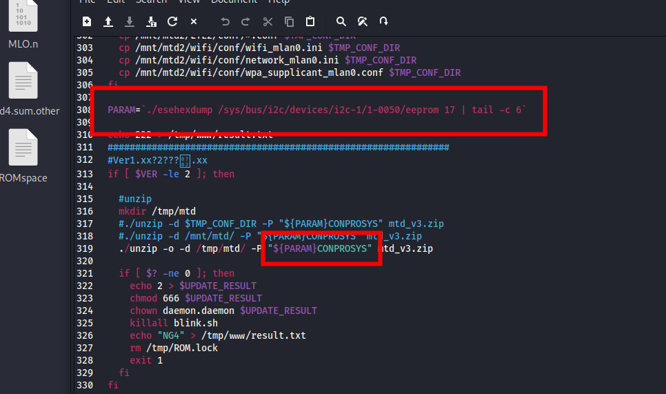
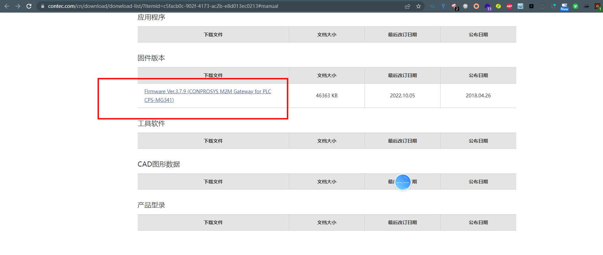
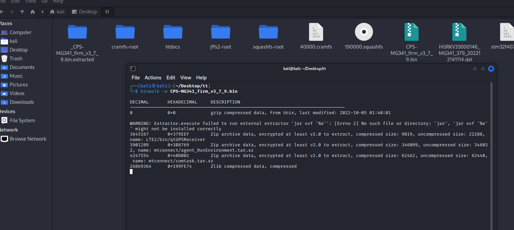
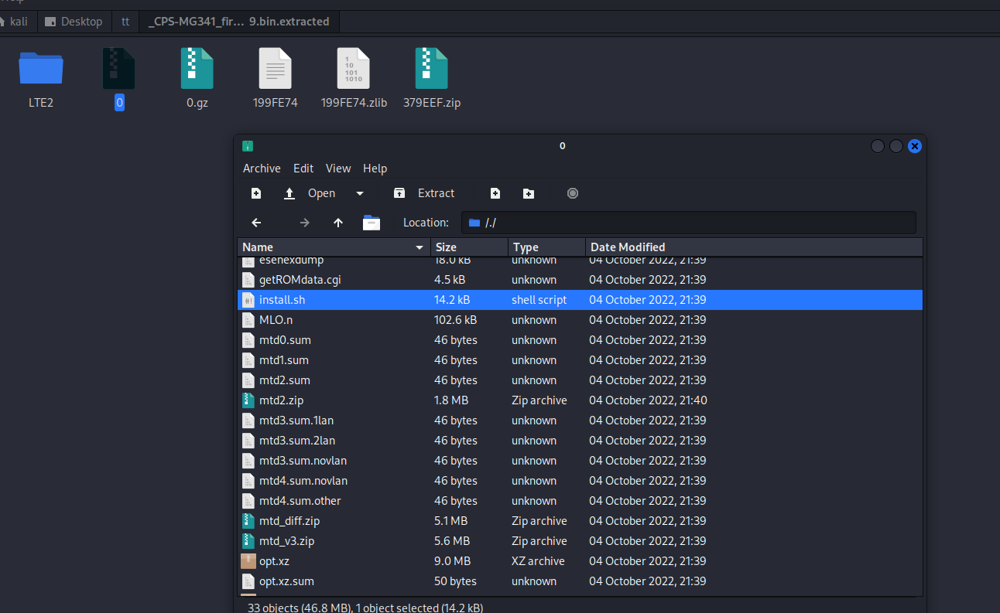
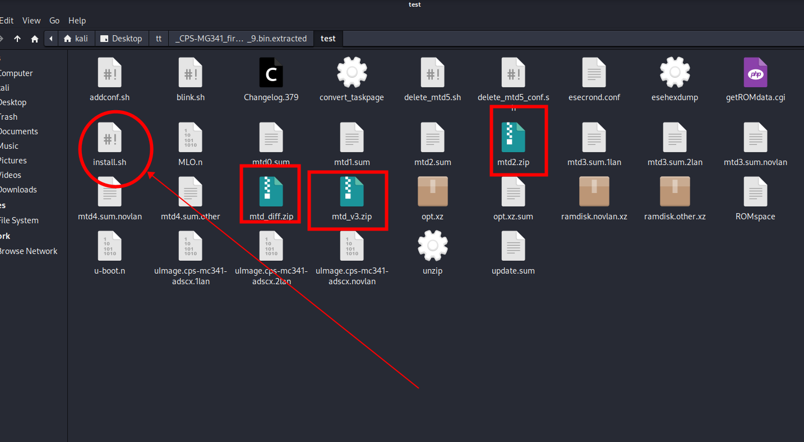
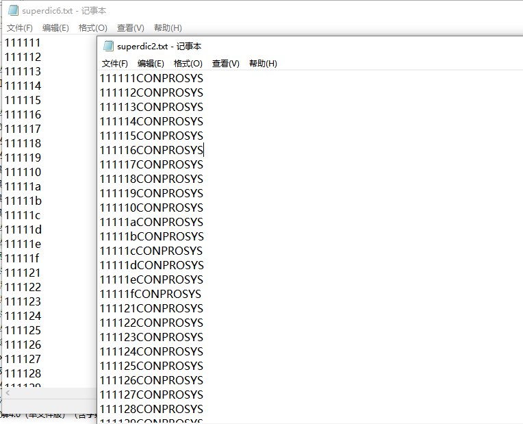
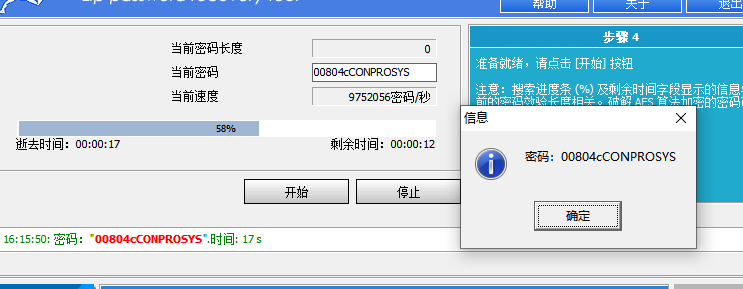
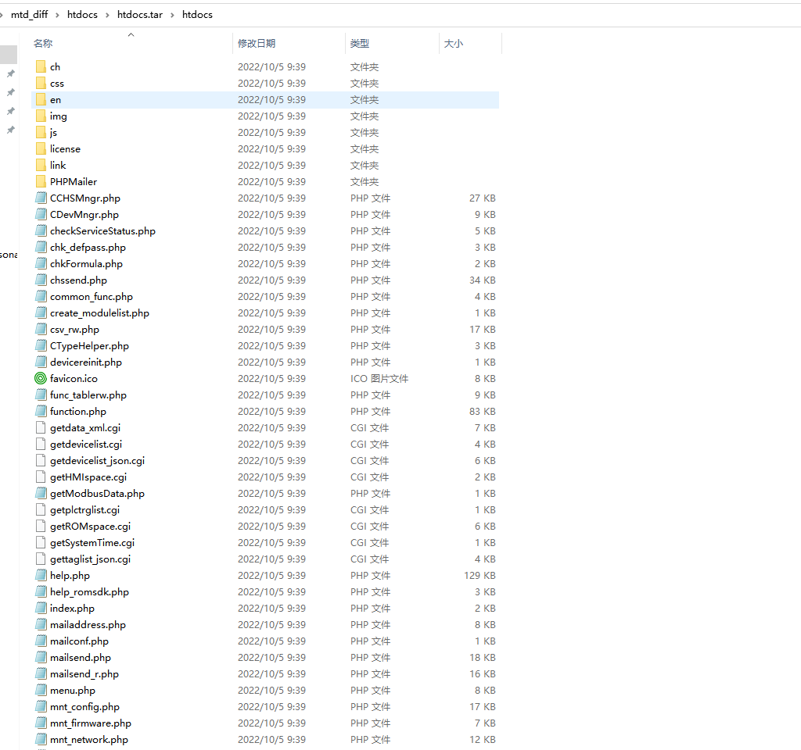

## **Vulnerability description**

Vulnerability name: Japan Contec Co., Ltd. M2M network management series
MG341 has a firmware password that can be cracked

Affected entity manufacturer name: Japan Contec Co., Ltd.

Affected Entity
Name：[CPS-MG341-ADSC1-931](https://www.contec.com/cn/products-services/daq-control/iiot-conprosys/m2m-gateway/cps-mg341-adsc1-931/price/)

Introduction link：

https://www.contec.com/cn/products-services/daq-control/iiot-conprosys/gateway/

## **product introduction：**

Contec MG341 is a M2M IoT gateway developed by Japan Contec Corporation
(Contec). Data of equipment controlled by PLC can be easily acquired. It
supports PLC products of many PLC manufacturers including MELSEC series
of Mitsubishi Electric Corporation, Sysmac series of Omron Corporation,
various series of JTEKT TOYOPUC, FP series of Panasonic Corporation, and
KV series of Keyence Corporation. One device can collect data from
multiple PLCs. Reading memory data (I/O status, data registers, link
registers, file registers, etc.) that stores setting data and control
results can send the collected information to the cloud server through
simple settings. Support PLC products from multiple manufacturers.
Information can be collected from multiple PLCs simultaneously. PLCs
from different vendors and different interfaces can be mixed together
and connected to the same M2M gateway.

## **Vulnerability description:**

Contec MG341, the official firmware package download address is
provided. The firmware package is unpacked using binwalk, which contains
encrypted firmware. The encryption key rules can be known through the
built-in installation script. Passwords can be brute force cracked
through the dictionary

## **Vulnerability location：**

Install.sh{width="5.7659722222222225in"
height="3.408333333333333in"}

## **verification process：**

1.  Download the firmware package

https://www.contec.com/cn/download/donwload-list/?itemid=c5facb0c-902f-4173-ac2b-e8d013ec0213#manual

{width="5.766666666666667in"
height="2.4493055555555556in"}

2.  Binwalk Unpack

Bingwalk -e xxx.bin

{width="5.761805555555555in"
height="2.5902777777777777in"}

{width="5.760416666666667in"
height="3.535416666666667in"}

3.  It contains encrypted firmware, and the encryption key rules can be
    known through the built-in installation script. Passwords can be
    brute force cracked through the
    dictionary{width="5.7659722222222225in"
    height="3.176388888888889in"}

{width="5.7659722222222225in"
height="3.408333333333333in"}

generate test dictionary：

6 bytes+CONPROSYS #Note 6 byte range is 0-9+a-f

{width="5.761805555555555in"
height="4.668055555555555in"}

{width="5.7659722222222225in"
height="2.2430555555555554in"}

The firmware password is：00804cCONPROSYS

4.  The background source code will come out

{width="5.759722222222222in"
height="5.4in"}

## security researcher

name1:   peishilong      

Please contact email: peisylon@foxmail.com

​      

name2:   zhangziyu

Please contact email: 584768970@qq.com
