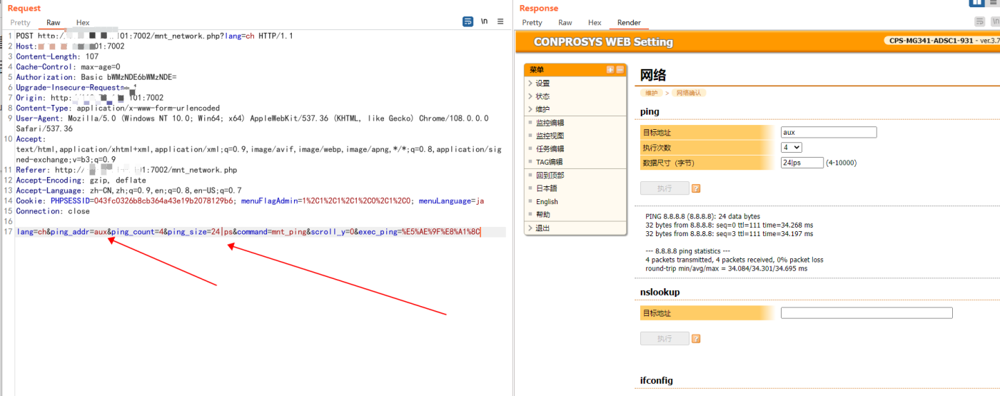

## **##Vulnerability description**

Vulnerability name：                  Contec Japan Co., Ltd. Arbitrary Command Execution Vulnerability in  MG341 Network Management Series

Affected Entity Vendor Name：        Contec Japan Co., Ltd.

Affected Entity Name ：   [CPS-MG341-ADSC1-931](https://www.contec.com/cn/products-services/daq-control/iiot-conprosys/m2m-gateway/cps-mg341-adsc1-931/price/)

Product introduction link：  https://www.contec.com/cn/products-services/daq-control/iiot-conprosys/gateway/

## product introduction：

Contec M2M MG341 is a M2M IoT network management product of Japan Contec Co., Ltd. (Contec). Data of equipment controlled by PLC can be easily acquired. Supports various series of MELSEC including Mitsubishi Electric Corporation, Sysmac series of Omron Corporation, JTEKT
Various series of TOYOPUC, FP series of Panasonic Corporation,
And the PLC products of many PLC manufacturers including Keyence's KV series. One device can collect data from multiple PLCs. Reading memory data (I/O status, data registers, link registers, file registers, etc.) that stores setting data and control results can send the collected information to the cloud server through simple settings. Support PLC products from multiple manufacturers. Information can be collected from multiple PLCs simultaneously. PLCs from different vendors and different interfaces can be mixed together and connected to the same M2M gateway.

## Vulnerability description：

The ping_size parameter in the background of the MG341 device is controllable, and there is any command execution to control the server.

source code file：

\\mtd_diff\\htdocs\\htdocs.tar\\htdocs\\mnt_network.php

Vulnerability trigger condition：

First log in, you can use these two administrators (official own users)

kantabhop:590401

mc341:mc341

{width="3.96875in"
height="1.0in"}

Screenshot of vulnerability trigger file：

{width="5.756944444444445in"
height="2.933333333333333in"}

Vulnerability parameters：    ping_size 

After the request is complete, request the http://ip:port/result.txt file once and you will see the command execution result

## verification process：

Home requires certification：

{width="5.763888888888889in"
height="3.1055555555555556in"}

Internal username and password: official factory password

kantabhop:590401

mc341:mc341

{width="5.7659722222222225in"
height="2.515972222222222in"}

{width="5.6125in"
height="3.689583333333333in"}

payload test 1：

payload output：Pwd

{width="5.757638888888889in"
height="2.1777777777777776in"}

{width="5.767361111111111in"
height="1.476388888888889in"}

payload test 2：

payload output：  ps -aux

{width="5.760416666666667in"
height="2.3604166666666666in"}

{width="5.7659722222222225in"
height="2.89375in"}

payload test 3：

View all files on the website and path：ls /opt/httpd/httpd-2.4.12/htdocs/

{width="5.754166666666666in"
height="2.702777777777778in"}

{width="5.761805555555555in"
height="3.08125in"}

payload test 4：

Check /etc/passwd：cat  /etc/passwd >/tmp/www/result.txt 

{width="5.754166666666666in"
height="2.702777777777778in"}

{width="5.754166666666666in"
height="2.702777777777778in"}

## security researcher

name1:   peishilong      

Please contact email: peisylon@foxmail.com

​      

name2:   zhangziyu

Please contact email: 584768970@qq.com

 
